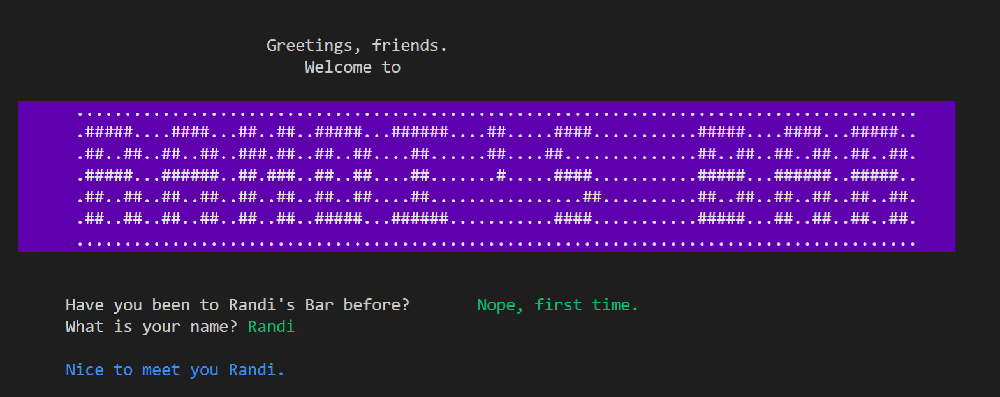

# Randi's Bar
A Ruby CLI app created to help those of us who never know what to drink

## Table of contents
* [General info](#general-info)
* [Screenshots](#screenshots)
* [Technologies](#technologies)
* [Setup](#setup)
* [Features](#features)
* [Status](#status)
* [Inspiration](#inspiration)
* [Contact](#contact)

## General info
Randi's Bar makes you your own personal bartender.  It can help you learn how to make that drink you always get at the bar but never knew how to make or it can suggest drinks so you can find your new favorite!  If you can't find what you're looking for, you can even make your own drink.

## Screenshots

## Technologies
* Ruby
* OpenURI - Gem used to ease API information pull
* TTY::Prompt - Gem that provides easy option selection
* Rainbow & Colorize - Gems used for colorization of text

## Setup
* Clone this repo to your local machine `git clone <this-repo-url>`
* run `cd CLI_API_project` to access
* run `bundle install` to install required dependencies
* run `ruby bin/run.rb` to head to the bar

## Features
* Colorful welcome display and greeting.
* Sign in feature which also saves your favorite drinks during the same session.
* Search for drinks based on ingredient, drink name, recently made drinks or your favorites.
* Create personalized drinks.

To-do list:
* Implement database functionality to save users, drinks and favorites for subsequent trips to the bar.

## Status
Project is in progress.  Would like to add database to make app more functional.

## Inspiration
Project inspired by my inability to decide what to drink ever.

## Contact
Bug reports and pull requests are welcome on GitHub at https://github.com/mimirandi21/CLI_API_project. 
